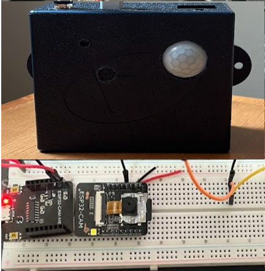

# 🌱 Smart Monitoring System (ESP32 + Backend + Telegram)

Sistema de monitoramento inteligente baseado em IoT utilizando **ESP32-CAM**, integração com **API backend** e notificações via **Telegram**.

O projeto vai além de um simples detector de movimento, simulando um cenário real de **arquitetura distribuída**, com coleta de eventos físicos, processamento em backend e envio de alertas em tempo real.

> 💡 Pode ser aplicado em: segurança residencial, monitoramento remoto, logística e soluções para **AgroTech (irrigação, sensores ambientais, etc.)**


## 📲 Resultado

Exemplo de notificação recebida via Telegram:



---

## 🚀 Visão do Projeto

Este projeto foi desenvolvido com foco em:

* Integração entre hardware (ESP32) e software (backend)
* Processamento de eventos em tempo real
* Arquitetura escalável para IoT
* Base para evolução em produto (SaaS / automação)

---

## 🧠 Arquitetura

```
ESP32-CAM (Sensor PIR + Câmera)
        ↓
     HTTP Request
        ↓
Backend (API)
        ↓
Banco de Dados (Logs / Eventos)
        ↓
Regras / Processamento
        ↓
Telegram API (Notificações)
```

---

## 📸 Funcionalidades

### ✔️ Atual

* Detecção de movimento via sensor PIR
* Captura de imagem com ESP32-CAM
* Envio automático para Telegram
* Integração com backend para registro de eventos

### 🚧 Roadmap (Próximos Passos)

* [ ] Dashboard web (React)
* [ ] Histórico de eventos e imagens
* [ ] Sistema de alertas configuráveis
* [ ] Integração com sensores (umidade, temperatura)
* [ ] Automação (ex: acionamento de irrigação)
* [ ] Multi-dispositivo / multi-cliente

---

## 🛠️ Hardware

* ESP32-CAM
* Sensor PIR (HC-SR501 ou similar)
* Fonte 5V
* Jumpers

---

## 💻 Tecnologias Utilizadas

### Firmware / IoT

* ESP32 (Arduino IDE)
* C++
* WiFi Client

### Backend

* API
* (Opcional) Express / Fastify

### Integrações

* Telegram Bot API

### Banco de Dados (opcional)

* PostgreSQL / Supabase

---

## ⚙️ Configuração

### 1. Clonar o projeto

```bash
git clone https://github.com/seu-usuario/esp32-cam-monitoring.git
cd esp32-cam-monitoring
```

---

### 2. Configurar ESP32

* Instalar suporte ESP32 na Arduino IDE:
  👉 https://github.com/espressif/arduino-esp32

* Instalar biblioteca:

  * `UniversalTelegramBot`

---

### 3. Configurar credenciais

No código do ESP32:

```cpp
const char* ssid = "SEU_WIFI";
const char* password = "SUA_SENHA";

String BOTtoken = "SEU_TOKEN_TELEGRAM";
String CHAT_ID = "SEU_CHAT_ID";
```

---

### 4. Upload para o ESP32

* Conectar via FTDI
* Selecionar placa: **AI Thinker ESP32-CAM**
* Fazer upload do código

---

## 🔌 Backend (Opcional, mas recomendado)

Este projeto pode funcionar apenas com Telegram, porém o backend permite:

* Persistência de eventos
* Logs estruturados
* Escalabilidade
* Integração com dashboards

### Exemplo de endpoint:

```http
POST /events

{
  "deviceId": "esp32-01",
  "type": "motion_detected",
  "timestamp": "2026-03-22T10:00:00Z"
}
```

---

## 📊 Possíveis Aplicações

* Segurança residencial
* Monitoramento de áreas remotas
* Controle de acesso
* Monitoramento agrícola (AgroTech)
* Automação de irrigação inteligente

---

## 🔥 Diferenciais Técnicos

* Integração end-to-end (hardware → backend → notificação)
* Arquitetura pronta para escalar
* Base para produto SaaS IoT
* Aplicação real em ambientes físicos

---

## 📌 Próximos Passos (Visão de Produto)

* Transformar em plataforma web
* Adicionar autenticação de usuários
* Suporte a múltiplos dispositivos
* Dashboard analítico
* Integração com cloud (AWS / OCI)

---

## 👨‍💻 Autor

Desenvolvido por **Felipe Domingues**
🔗 GitHub: https://github.com/Felipedmgs

---

## 📄 Licença

Este projeto está sob a licença MIT.
